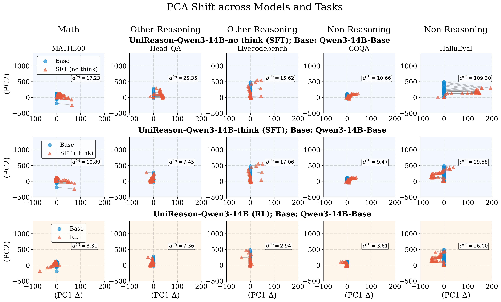

## 🔬 Exploring Model Transferability with PCA Shift

PCA Shift allows you to explore how different training strategies—such as supervised fine-tuning (SFT) and reinforcement learning (RL)—reshape your model’s internal feature space. While SFT can boost reasoning on tasks like math or code, it often narrows general-domain ability and limits knowledge transfer. RL, in contrast, typically promotes broader generalization. Through PCA shift analysis, you can visualize and quantify how your model’s internal structure evolves, helping you determine whether improvements are genuinely transferable or come at the expense of overall versatility.

---

## 🚀 Quick Start

### 1. Set Up Your Experiment

Open `PCA_shift.sh` in your favorite text editor and adjust the parameters:

* `K`: Number of queries for PCA (e.g., 100)
* `TASKS`: Dataset types (such as `MATH500`, `Livecodebench`)
* `base_models`, `fine_tuned_models`: Names of the models before and after training

Example in `PCA_shift.sh`:

```bash
export CUDA_VISIBLE_DEVICES="Your_gpu_number"
K=100
base_models=("model_name")
fine_tuned_models=("model_name")
TASKS=("MATH500")
```

Save the script and run:

```bash
bash PCA_shift.sh
```

This generates a `.json` file (such as `{model_name}_pca_shift.json`) containing the PCA-transformed features.

### 2. Visualize the Results

Launch Jupyter Notebook and open `pictures.ipynb`. You can adjust parameters like `target_benchmarks`, `files`, or `result_distance` to view PCA plots from different perspectives.

Tip: Small changes in these parameters can reveal different aspects of your model’s internal changes.

### 3. Output Files

* `{model_name}_pca_shift.json`: PCA data for your experiments
* `PCA_Shift_SFT_RL.pdf` or `.png`: Visualizations of feature space changes

### 4. Results

After running the analysis, you will find the generated PCA plots saved as PDF files (such as `PCA_Shift_SFT_RL.pdf`).
Below is an example of what your output might look like:

<p align="center">
  
</p>

This plot shows how the model’s internal representations differ under various training settings. The first two rows show models trained with SFT, and the last row shows models trained with RL. RL training results in the smallest PCA shift for all task types, suggesting more stable latent representations.

### 5. Key Findings

* RL-based fine-tuning best preserves general-domain representations and reduces forgetting.
* Larger models are more stable, but scaling alone is not sufficient for generalization.
* Qwen models are especially sensitive to reasoning-focused pre-training data.
* Only RL consistently supports knowledge transfer without sacrificing general performance.

---

> **Note:**
> This code is based on and extends [Representational\_Analysis\_Tools](https://github.com/XiaoyuXU1/Representational_Analysis_Tools) by Xiaoyu Xu.

